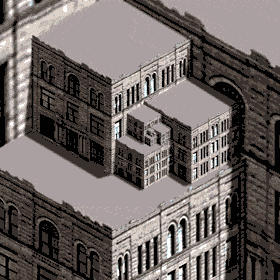

# Languages_model
# @date 2026-06-15 (modified)

A model for the evolution of humanity's number of languages used in projects with Peter Culicover.



## Papers and presentations related to this model

* 2003: Linguistic theory, explanation and the dynamics of grammar. https://www.researchgate.net/publication/234038568_Linguistic_theory_explanation_and_the_dynamics_of_grammar
* 2003: Linguistic theory, explanation and the dynamics of language. https://www.researchgate.net/publication/236007873_Linguistic_theory_explanation_and_the_dynamics_of_language
* 2005: Wpływ społeczny jako model rozprzestrzeniania się memów/Social impact as a model for the spread of memes. https://www.researchgate.net/publication/260059435_Wplyw_spoleczny_jako_model_rozprzestrzeniania_sie_memow
* 2006: Social influence in language change. Presentation at the GIACS Workshop on Language Simulations. https://www.researchgate.net/publication/236007846_Social_influence_in_language_change_presentation_at_the_GIACS_Workshop_on_Language_Simulations
* 2007: Modelowanie konkurencji między językami/Modeling the competition between languages. https://www.researchgate.net/publication/260059539_Modelowanie_konkurencji_miedzy_jezykami_Modeling_the_competition_between_languages
* 2010: Social influence model of language competition. https://www.researchgate.net/publication/299287224_Social_influence_model_of_language_competition

## COMPILATION

To compile, you need to download the "https://github.com/borkowsk/symShell2andRTM" repository and place it in the cousin directory as below (or modify the path in the CMakeLists.txt file)

```
FolderChosenByYou/
├── arch
│   └── Languages_model
└── public
    ├── symShell2andRTM        (Inside there is a verified version of "symShellLight" in the SYMSHELL folder)
    └── symShellLight          (If you want to use the latest version)
```

## USAGE

Compiled application you can start from command line with many possible options:

```
language -gray+ AUTO=5 WIDTHWIN=150 HEIGHTWIN=51 MAX=10 LOGC=10 LOGF=log2.out
```
Most useful options:

* -gray+  - displays in grayscale
* AUTO=5  - 5 repetitions of the experiment (without waiting for the user)
* WIDTHWIN=150 HEIGHTWIN=51 - window size; here small for maximum acceleration
* MAX=10  - 10 steps of each simulation (in this case)
* LOG=10  - recording every 10 steps, i.e. at the end. The state of step 0 and the final step will be saved.
* LOGF=log2.out - output filename.
* HELP - list of all possible options.

